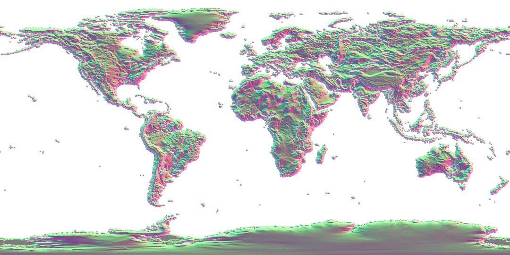

Normal_Heights_LabPBR
==============

Just a simple (rust) library to create a normal LabPBR map from a height map.

See [LabPBR Docs](https://shaderlabs.org/wiki/LabPBR_Material_Standard) for more information.

Material AO (Blue channel) not implemented yet.

Also includes a thin CLI wrapper.

Example Library Usage
---------------------

```rust
    let img = image::open(input)?;
    let normal_map = normal_heights_labpbr::map_normals(&img);
    normal_map.save(output)?;
```

```rust
    let img = image::open(input)?;
    let strength = 3.14;
    let normal_map = normal_heights_labpbr::map_normals_with_strength(&img, strength);
    normal_map.save(output)?;
```

For a fully executable example, see src/main.rs.

CLI Wrapper
-----------

### Help String

```
USAGE:
    normal-heights [OPTIONS] <INPUT> <OUTPUT>

FLAGS:
    -h, --help       Prints help information
    -V, --version    Prints version information

OPTIONS:
    -s, --strength <strength>
            Strength of the resulting normal map. [default: 6.0]


ARGS:
    <INPUT>     Input height map image file.
    <OUTPUT>    Filename to write the normal map to.
```

### Example Usage

```sh
    normal-heights-labpr heightmap.png normalmap.png
```

Supported Image Formats
-----------------------

See Image crate, [version ^0.25.2](https://github.com/image-rs/image/tree/main?tab=readme-ov-file#supported-image-formats).

Example Output
--------------

### Misc shapes:

Input:


Output (strength 3.14):


Output (strength 8):


### World:

Input:


Output (default strength 6):


